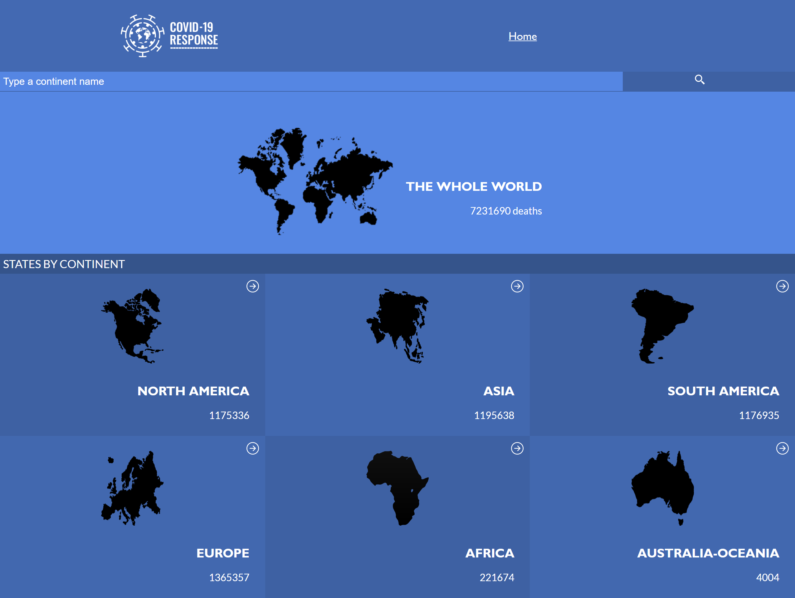
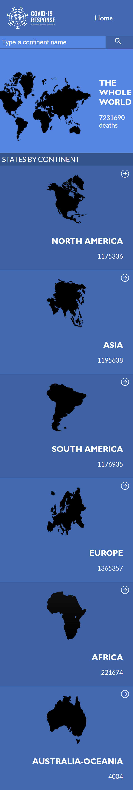

# Metrics Webapp

> The metrics web app is a site that shows metrics for coronavirus deaths

> |Big Screen       |Small Screen|
> |--------------|--------------|
> |||

> And you can see which countries have the most deaths
## Built With
- ReactJS
- Styled Components
- Redux
- Linters

### Prerequisites
  - #### Knowledge of these technologies
    - ReactJs
    - Redux
### Setup
  * Open your command
  * Type "git clone https://github.com/ahmed-al-farouq/Metrics-Webapp.git"
  * npm i
  * npm run start
### Run the app
  * npm run start

### Deployment
  * npm run build

## Testing
  * npm run test
## Authors

:bearded_person: **Ahmed Al-Farouq**
  - Github: [@Ahmed-Alfarouq](https://github.com/ahmed-al-farouq)
  - LinkedIn: [LinkedIn](https://www.linkedin.com/in/ahmed-al-farouq/)
  - Twitter: [@twitter](https://twitter.com/ahmed_al_farouq)

## 🤝 Contributing

Contributions, issues, and feature requests are welcome!

Feel free to check the [issues page](../../issues/).

## Show your support

Give a ⭐️ if you like this project!

## Acknowledgments

- Hat tip to anyone whose code was used
- Inspiration
- etc

## 📝 License

The design created by [Nelson Sakwa](https://www.behance.net/sakwadesignstudio)
